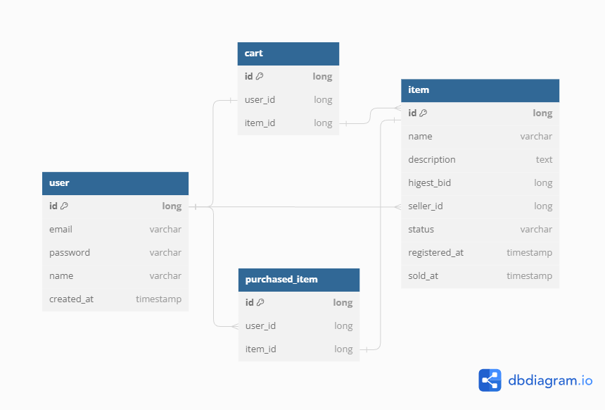

# BestOffer

누구나 참여할 수 있는 공개 입찰 경매 서비스입니다

## 프로젝트 기능 및 설계
- 회원가입 기능
  - 사용자는 고유의 이메일과 패스워드르르 입력하여 회원 가입을 할 수 있습니다.
  - 카카오, 네이버계정으로도 회원가입이 가능합니다. (OAuth 2.0)

- 로그인 기능
  - 사용자는 카카오/네이버 계정 (OAuth 2.0), 혹은 회원가입 시 입력했던 이메일과 패스워드로 로그인할 수 있습니다. 
  - 사용자가 잘못된 정보를 기입했을 시 로그인을 불허합니다.

- 경매 품목 등록 기능 
  - 모든 사용자는 판매하고 싶은 물품을 경매 등록할 수 있습니다.
  - 사용자는 물품 경 등록 시 시작가와 경매기간을 고지해야 하며, 품목의 이미지 등록(Amazon S3), 카테고리 설정 또한 필수로 수행해야 합니다.

- 경매 품목 조회 기능 
  - 경매 이전 혹은 진행 중인 품목들을 검색하여 조회할 수 있습니다. (Elastic Search)
  - 품목 검색 시 카테고리 설정이 가능합니다.
  - 리스트된 품목들의 판매자 정보 및 다른 상세 정보들을 확인할 수 있습니다.
  - 검색 결과는 인기순(경매 이전일 경우 관심 등록 순, 진행 중일 경우 입찰자 순)으로 나열됩니다.

- 관심 품목 등록 기능
  - 사용자는 관심 품목들을 지정할 수 있습니다 
  - 경매 시작 이전인 품목들만 관심 등록이 가능하며 해당 품목의 경매가 마감된 즉시 관심 리스트에서 제외됩니다. (Scheduler - cron)

- 경매 참여 기능
  - 사용자는 본인이 입찰 희망 품목의 경매에 참여할 수 있습니다.
  - 해당 품목의 경매 기간동안에만 참여가 가능합니다. 
  - 경매 개시 시점의 현재 최고가는 판매자가 지정한 시작가이며 경매 기간동안 실시 업데이트됩니다.
  - 구매 희망자들은 현재 최고가 이하의 금액을 입찰할 수 없습니다.
  - 공개 입찰 방식을 채택하며, 경매 품목은 가장 높은 금액을 제시한 입찰자에게 낙찰됩니다.

- 사용자 관련 품목 조회 기능
  - 사용자는 본인이 판매한 경매 품목들을 조회할 수 있습니다.
  - 사용자는 본인이 낙찰받은 경매 품목들을 조회할 수 있습니다.
  - 사용자는 본인이 관심 등록한 경매 품목들을 조회할 수 있습니다.

## ERD 

## Trouble Shooting
[go to the trouble shooting section](doc/TROUBLE_SHOOTING.md)

### Tech Stack

 
   
   
   
  

